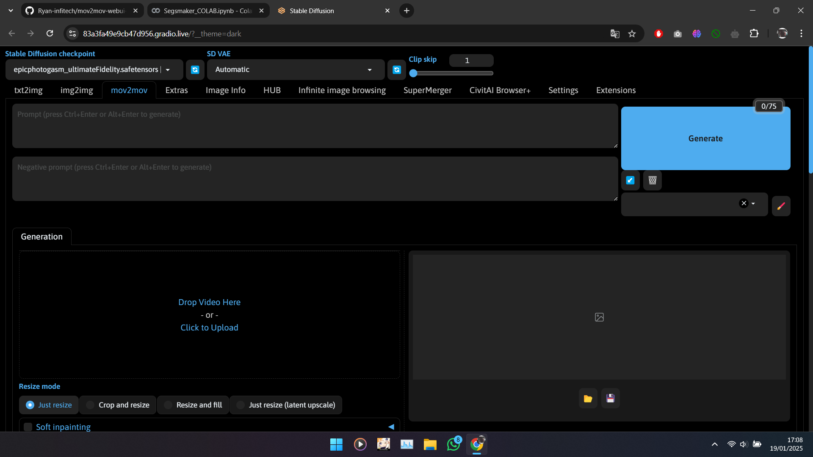

 |

 

# mov2mov-webui-Stable-Diffusion
This is a mov2mov plugin for stable diffusion still [WORK]()

## Mov2mov
Automatic1111/stable-diffusion-webui.

### Features:
- Process frames directly from video
- Repackage into video after processing
- Video Editing (beta)
  - Significantly reduces video flicker with keyframe merging!
  - You can adjust keyframe selection or generate keyframes automatically.
  - Tag keyframes with backpropagation
  - Currently only available for Windows; if your system doesn't support it, you can disable this tab.

Additionally, Mov2mov will work better with the [bg-mask](https://github.com/Scholar01/sd-webui-bg-mask) plugin

# Table of Contents

- [Table of Contents](#table-of-contents)
  - [Usage Rules](#usage-rules)
  - [Installation](#installation)
  - [Changelog](#changelog)
  - [Instructions](#instructions)
  - [Acknowledgments](#acknowledgments)

## Usage Rules

1. Please resolve video authorization issues on your own. All problems arising from unauthorized video usage must be borne by the user. This has nothing to do with Mov2mov!
2. All videos created with Mov2mov and published on video platforms must clearly cite the source video used for conversion in their description. For example, if you use someone else's video and convert it through AI, you must provide a clear link to the original video; if you use your own video, you must also state this in the description.
3. All copyright issues caused by input sources must be borne by the user. Note that many videos explicitly state that they cannot be reproduced or copied!
4. Please strictly comply with national laws and regulations to ensure content is legal and appropriate. All legal responsibilities caused by using this plugin must be borne by the user. This has nothing to do with Mov2mov!

## Installation

1. Open the Extensions tab.
2. Click on Install from URL.
3. Enter the git repository URL for the extension.
4. Click Install.
5. Restart WebUI.

## Changelog

[...]()

## Instructions

- Video tutorials:
  - [https://www.bilibili.com/video/BV1Mo4y1a7DF](https://www.bilibili.com/video/BV1Mo4y1a7DF)
  - [https://www.bilibili.com/video/BV1rY4y1C7Q5](https://www.bilibili.com/video/BV1rY4y1C7Q5)
- QQ Channel: [https://pd.qq.com/s/akxpjjsgd](https://pd.qq.com/s/akxpjjsgd)
- Discord: [https://discord.gg/hUzF3kQKFW](https://discord.gg/hUzF3kQKFW)

## Acknowledgments

- Scholar01 [https://github.com/Scholar01](https://github.com/Scholar01)
- gizemgizg [https://github.com/gizemgizg](https://github.com/gizemgizg)
- gutris1 [https://github.com/gutris1](https://github.com/gutris1)
- modnet-entry: [https://github.com/RimoChan/modnet-entry](https://github.com/RimoChan/modnet-entry)
- MODNet: [https://github.com/ZHKKKe/MODNet](https://github.com/ZHKKKe/MODNet)
- Ezsynth: [https://github.com/Trentonom0r3/Ezsynth](https://github.com/Trentonom0r3/Ezsynth)

## Contact

If you have any questions or suggestions, please open a new issue in this repository.

