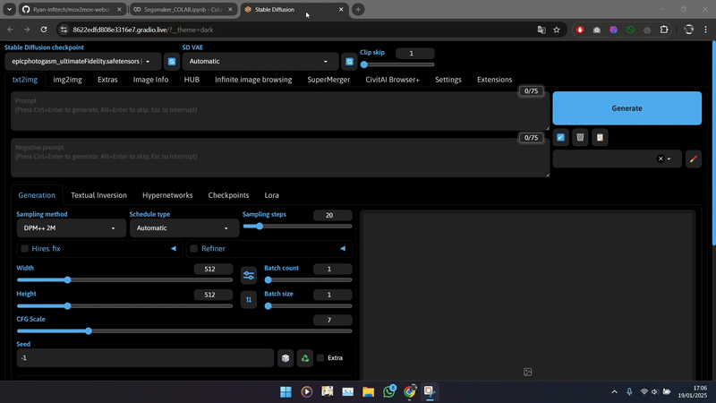

# mov2mov-webui-Stable-Diffusion
ini adalah plugin mov2mov untuk stable diffusion [ 18/01/2025 ] work

## Mov2mov
Automatic1111/stable-diffusion-webui.

### Fitur:
- Memproses frame langsung dari video
- Mengemas ulang menjadi video setelah pemrosesan
- Pengeditan Video (beta)
  - Secara signifikan mengurangi flicker video dengan penggabungan keyframe!
  - Anda dapat menyesuaikan pemilihan keyframe atau menghasilkan keyframe secara otomatis.
  - Tag keyframe dengan backpropel
  - Saat ini hanya tersedia untuk Windows; jika sistem Anda tidak mendukung, Anda dapat mematikan tab ini.

Selain itu, Mov2mov akan bekerja lebih baik dengan plugin [bg-mask](https://github.com/Scholar01/sd-webui-bg-mask) 

# Daftar Isi

- [Daftar Isi](#daftar-isi)
  - [Peraturan Penggunaan](#peraturan-penggunaan)
  - [Instalasi](#instalasi)
  - [Ucapan Terima Kasih](#ucapan-terima-kasih)
  - [Kontak](#kontak)

## Peraturan Penggunaan

1. Silakan selesaikan sendiri masalah otorisasi untuk sumber video. Semua masalah yang timbul karena penggunaan video tidak berizin harus ditanggung oleh pengguna. Hal ini tidak ada hubungannya dengan Mov2mov!
2. Semua video yang dibuat dengan Mov2mov dan diterbitkan di platform video harus secara jelas mencantumkan sumber video yang digunakan untuk konversi dalam deskripsinya. Misalnya, jika Anda menggunakan video orang lain dan mengonversinya melalui AI, Anda harus menyediakan tautan yang jelas ke video asli; jika Anda menggunakan video milik sendiri, Anda juga harus mencantumkannya dalam deskripsi.
3. Semua masalah hak cipta yang disebabkan oleh sumber input harus ditanggung oleh pengguna. Perhatikan bahwa banyak video secara eksplisit menyatakan bahwa mereka tidak dapat direproduksi atau disalin!
4. Harap patuhi hukum dan peraturan nasional dengan ketat untuk memastikan bahwa konten legal dan sesuai. Semua tanggung jawab hukum yang disebabkan oleh penggunaan plugin ini harus ditanggung oleh pengguna. Hal ini tidak ada hubungannya dengan Mov2mov!

## Instalasi

1. Buka tab Extensions.
2. Klik pada Install from URL.
3. Masukkan URL repositori git untuk ekstensi tersebut.
4. Klik Install.
5. Restart WebUI.

## Ucapan Terima Kasih

- Scholar01 [https://github.com/Scholar01](https://github.com/Scholar01)
- gizemgizg [https://github.com/gizemgizg](https://github.com/gizemgizg)
- gutris1 [https://github.com/gutris1](https://github.com/gutris1)
- modnet-entry: [https://github.com/RimoChan/modnet-entry](https://github.com/RimoChan/modnet-entry)
- MODNet: [https://github.com/ZHKKKe/MODNet](https://github.com/ZHKKKe/MODNet)
- Ezsynth: [https://github.com/Trentonom0r3/Ezsynth](https://github.com/Trentonom0r3/Ezsynth)

 

## Kontak

Jika Anda memiliki pertanyaan atau saran, silakan buka issue baru di repository ini.

